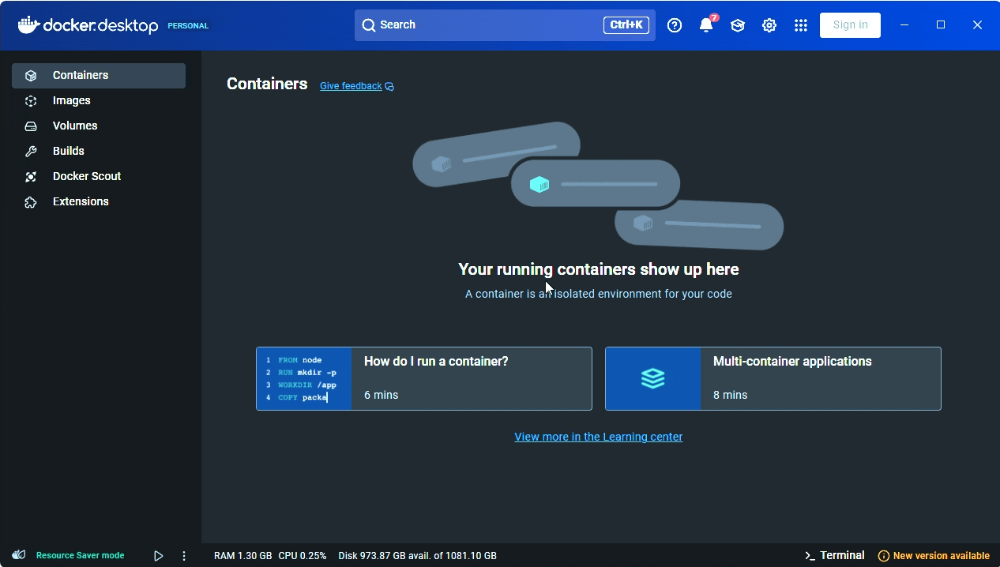
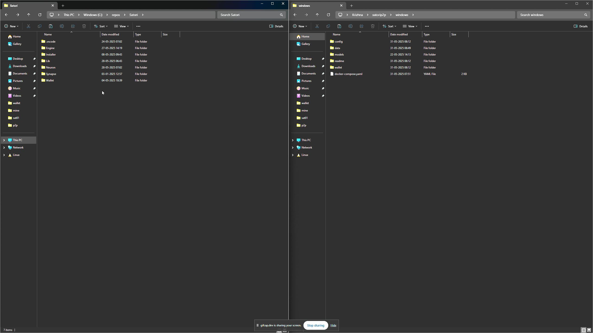

# Satori P2P Setup - Windows

## Prerequisites

1. Install [Docker Desktop for Windows](https://docs.docker.com/desktop/setup/install/windows-install/)
2. Enable host networking in Docker Desktop:
   - Open Docker Desktop
   - Go to Settings → Resources → Network
   - Enable "Use host networking"
   - Restart Docker Desktop




## Installation

### 1. Clone Repository
```cmd
git clone https://github.com/SatoriNetwork/Installer.git
cd satori-p2p/windows
```

### 2. Configure Ports
Edit `config\config.yaml` to set your desired Server and UI ports (default: 24600, 24601).

### 3. Add Wallet (Optional)
Place your `wallet.yaml` and `vault.yaml` files into the `wallet` folder if you have an existing wallet.

### 4. Add Old Data and Models (Optional)
If you are using an existing wallet, you can also copy all the data-stream ( containing csv and readme.md ) and model folders  residing inside the `data` and `models\veda`  folder of the old Neuron into the `data` folder and `models\veda` of this directory.



### 5. Update Docker Compose Configuration
Edit `docker-compose.yaml` and update the volume paths with where the file is located:
```yaml
volumes:
  - C:\Users\YourUsername\satori-p2p\windows\config:/Satori/Neuron/config
  - C:\Users\YourUsername\satori-p2p\windows\wallet:/Satori/Neuron/wallet
  - C:\Users\YourUsername\satori-p2p\windows\data:/Satori/Neuron/data
  - C:\Users\YourUsername\satori-p2p\windows\models:/Satori/Neuron/models
```

### 6. Start Application
```cmd
docker compose up -d
```

## Managing the Application

### View Logs
```cmd
docker logs -f satorip2p
```

### View Individual Application Logs

Satori P2P runs three integrated programs in one container:
- **Neuron** - Collects the Peer info from server, Powers the UI and more
- **Data Server** - Data management
- **Engine** - AI Engine

```cmd
docker exec -it satorip2p bash
cat neuron.log
cat data.log
cat engine.log
```

### Stop Application
```cmd
docker compose down
```

## Troubleshooting

### Check Running Containers
```cmd
docker ps
```

### Check Port Usage
```cmd
netstat -an | findstr :24600
netstat -an | findstr :24601
```

## Firewall Configuration

Windows Firewall typically doesn't block Docker containers when host networking is enabled. If you experience connection issues, you may need to add firewall rules:

### Using PowerShell (Run as Administrator)
```powershell
New-NetFirewallRule -DisplayName "Satori P2P Server" -Direction Inbound -Protocol TCP -LocalPort 24600 -Action Allow
New-NetFirewallRule -DisplayName "Satori P2P UI" -Direction Inbound -Protocol TCP -LocalPort 24601 -Action Allow
```

